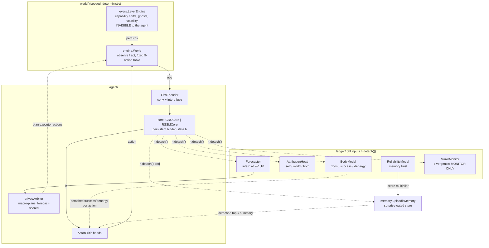
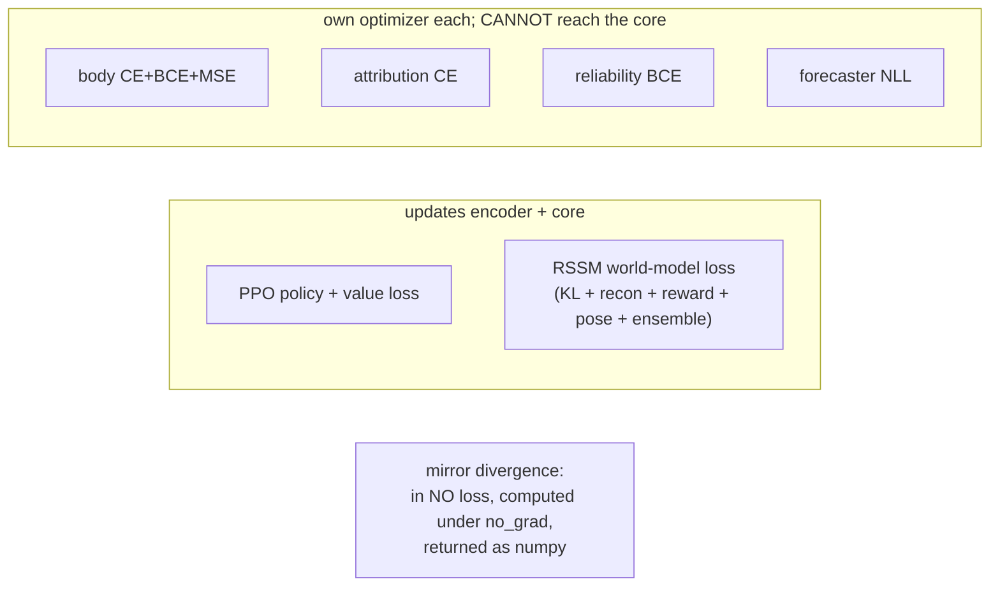

# Architecture

Everything below is read from the code as of stage-6a; file references are
the source of truth.

## Components

Solid arrows carry gradient; dotted arrows are detached (information flows,
gradient does not).

## The gradient-isolation rule

**The core trains only on world-prediction + task loss.** Every Ledger head
consumes `h.detach()`; every Ledger output entering the policy is detached
again before concatenation. Backprop map:

Enforced by `tests/test_grad_isolation.py` (per-head backward + param.grad
checks, plus an integration test through the real trainer) and
`tests/test_mirror.py` (divergence is graph-free numpy). A self-model
optimized into agreement with the world model would be useless as a
disagreement detector — hence monitored, never minimized.

## Data flow: wake vs sleep (`training/sleep.py`)

**Wake** (`CircadianTrainer.wake_phase`): env stepping with the current
policy under `torch.no_grad()`; transitions go to prioritized replay
(`training/replay.py`); ONLINE updates run for the Ledger heads only (body,
attribution, reliability). A test asserts encoder/core/actor-critic are
bit-identical across a wake stretch.

**Sleep** (every `rssm.sleep_every` env steps — scheduling is a pure
function of the step counter, `is_sleep_tick(env_steps, sleep_every)`, and a
signature test keeps it that way): `sleep_grad_steps` iterations of
(a) world-model training on prioritized replay sequences and (b)
Dreamer-style imagination — RSSM prior rollouts, REINFORCE actor on
normalized lambda-return advantages, critic MSE against a slow-EMA target
critic. The forecaster trains here too, on stored (h, plan,
realized-future) tuples. Episodic-memory pruning happens during sleep.

The stage-2/3 PPO path (`training/ppo.py`, `agent.core: gru` or `rssm`)
remains the simpler alternative: one on-policy PPO update per rollout, with
the world-model loss joining PPO's backward pass when the core is RSSM.

## The evidence plane (`evidence/`, stage-C)

One read-only store over a run dir, shared by the proposal generators and
the researcher. `EvidenceStore(run_dir)` loads the JSONL event log, TB
scalars, the latest competence report, the config, and a repo snapshot
`{git_sha, dirty}` (injected, or read from `runs/<id>/repo_snapshot.json`,
else unknown — the package never runs git; capture lives in
`experiments/provenance.py`, outside the trust boundary). `store.view(source)`
returns a source-scoped `EvidenceView` (the pre-stage-C `Evidence`, kept as
an alias): `logs_only` strips every Ledger-derived scalar and the
competence report, `ledger` keeps them — the control condition the proposal
science rests on. `store.bundle(source)` returns an immutable, content-hashed
`EvidenceBundle`; that hash is the `provenance.evidence_bundle_hash` a
proposal records (schema v2), and citations may be `tb:<tag>@step=`,
`competence:…`, or `code:<path>@<sha>#Lx-Ly`. `evidence/` obeys the same
structural rules as `proposals/`/`researcher/` (data-not-code, import bans,
read-only) and is scanned by `tests/test_proposals_no_execution.py`;
`proposals/evidence.py` is a deprecated re-export shim.

## Config reference

Resolution: YAML with `inherit:` chains (`world/config.py`); the resolved
dict is hashed into checkpoints and refuses to resume across mismatches
(`--allow-config-mismatch` to override). Sections (canonical values in
[training.md](training.md); every key used by code, no magic numbers):

| section | consumed by |
|---------|-------------|
| `seed`, `device`, `amp` | everything; `world` seeding is `seed*100000+env_counter` |
| `world.*` | `world/engine.py` (size, obs_window, day_length, terrain/energy/fatigue/food/water/shelter), `world.levers` -> `world/levers.py` only |
| `agent.*` | encoder channels, `hidden_size`, `gru_layers`, `core: gru\|rssm`, `controller: actor\|arbiter`, `use_ledger_features` (architecture-B ablation) |
| `ppo.*` | `training/ppo.py`: rollout/BPTT geometry, optimizer, reward terms, `episode_length` (trainer-side boundaries) |
| `rssm.*` | `agent/core_rssm.py` dims + losses; `training/sleep.py` replay/sleep/imagination knobs; `rssm.monitor` -> participation-ratio detector |
| `ledger.*` | head widths + lrs; `ledger.arbiter` plan scoring; `ledger.reliability` verification |
| `memory.*` | `memory/episodic.py` capacity/gate/retrieval |
| `mirror.*` | `ledger/mirror.py` threshold + probe/MPC responses |
| `checkpoints.*`, `run.*` | checkpoint cadence; logging (JSONL, viz dumps, TB) |
